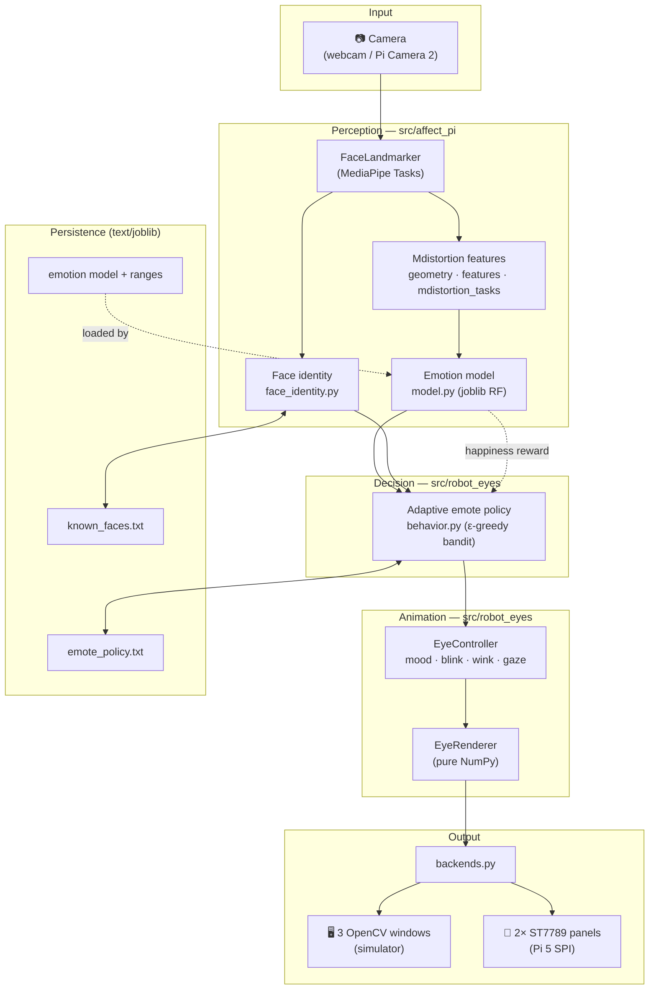
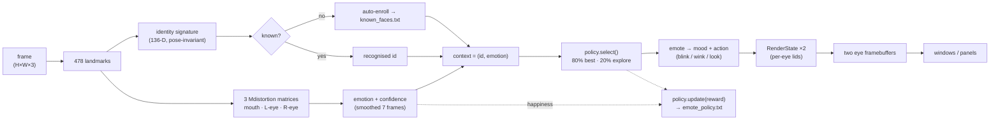
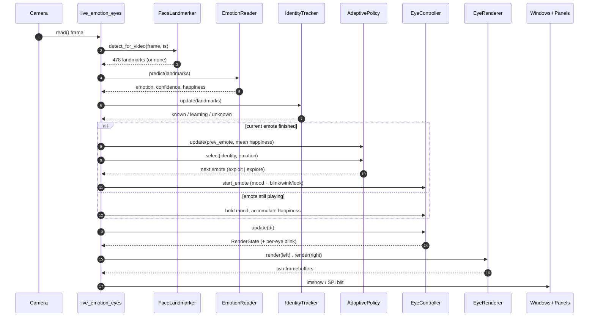

# affect-pi-base 👀

> A Raspberry Pi 5 companion that watches you on a camera, reads your emotion, and
> reacts with two cute pixel-art "robot eyes" on dual displays — learning over time
> which expressions cheer you up.


It runs on a laptop webcam today (in VS Code, with on-screen window simulators) and
on a Pi 5 + two ST7789 LCD panels later — the same renderer feeds both.

> ⚠️ Facial-emotion inference is noisy and context-dependent (the bundled model is
> ~53% accurate over 5 classes). Use consent, store only what you need, and don't
> use this for high-stakes decisions.

---

## Contents

- [Architecture](#architecture)
- [Data flow](#data-flow)
- [Per-frame interaction](#per-frame-interaction)
- [File structure](#file-structure)
- [Install](#install)
- [Run it](#run-it)
- [Train the models](#train-the-models)
- [Performance & RAM](#performance--ram)
- [Tests](#tests)
- [Commands](#console-commands)

---

## Architecture

Two cooperating Python packages with a thin app layer on top:



**How to read it.** The **Perception** package (`affect_pi`) turns a camera frame
into *what* the face is doing (emotion) and *who* it is (identity). The **Decision**
layer (`robot_eyes.behavior`) chooses an *emote* — not a 1:1 mirror, but a learned
choice that tries to maximise your happiness. **Animation** turns that choice into
per-eye pixels, and **Output** sends them to either OpenCV windows (dev) or the SPI
panels (Pi). The dashed **happiness reward** arrow closes the loop: the emotion the
display provoked becomes the training signal for the policy.

---

## Data flow

What happens to one frame, end to end:



**Key transforms.** Landmarks → **Mdistortion** (normalized pairwise-distance
matrices of node groups) is the project's signature feature. The same landmarks
feed a **separate, expression-invariant** signature for identity (rigid points
only: nose, eye corners, cheeks, temples). The chosen emote plays for ~2.5 s while
the system samples your happiness; that average becomes the reward written back to
`emote_policy.txt`, per person and per mood.

---

## Per-frame interaction

The live loop in [`scripts/live_emotion_eyes.py`](scripts/live_emotion_eyes.py):



**The feedback loop.** Steps 11–12 are the heart of the adaptation: when an emote's
display time ends, its accumulated happiness is credited to it (`policy.update`),
then the next emote is chosen — usually the best-known for this `(person, mood)`,
sometimes a random trial. Recognition (step 7–8) keeps the learning **per person**.

---

## File structure

```
affect_pi_base/
├── src/
│   ├── affect_pi/                 # 👁  vision + emotion package
│   │   ├── camera.py              # webcam / Pi Camera 2 + make_camera factory
│   │   ├── detectors.py           # MediaPipe (legacy) face-mesh + pose
│   │   ├── clusters.py            # landmark cluster definitions
│   │   ├── geometry.py            # distance/angle matrices, EAR, ratios
│   │   ├── features.py            # landmarks → facial_distortions
│   │   ├── status.py · pipeline.py# face/body/can't-see pipeline
│   │   ├── model.py               # emotion-model adapters (placeholder / joblib)
│   │   ├── trend.py               # Gaussian online baseline + anomaly z-scores
│   │   ├── main.py                # classic pipeline CLI  (affect-pi)
│   │   ├── mdistortion_tasks.py   # shared MediaPipe Tasks feature extractor
│   │   ├── train_mdistortion_de.py# YOLO + DE training over 3 Mdistortion matrices
│   │   ├── train_emotion_tasks.py # Tasks-API emotion trainer (no YOLO needed)
│   │   ├── eval_emotion_tasks.py  # held-out confusion-matrix eval
│   │   ├── train_yolo_face.py     # faces.csv → YOLO dataset + detector
│   │   ├── live_tasks_demo.py     # standalone live landmark/Mdistortion overlay
│   │   ├── face_identity.py       # face signature + known-faces registry
│   │   ├── memtools.py            # cross-platform RAM measurement
│   │   ├── DE_nodes.py            # Differential Evolution optimizer
│   │   └── DFO_image.py           # Dispersive Fly Optimization optimizer
│   └── robot_eyes/                # 🤖 dual-display eyes package
│       ├── config.py              # panel/eye/anim/hw params + Mood enum
│       ├── renderer.py            # pure-NumPy per-eye renderer (SDF + lids)
│       ├── controller.py          # mood · blink · wink · gaze state machine
│       ├── behavior.py            # emote library + adaptive ε-greedy policy
│       ├── backends.py            # SpiBackend (panels) / SimBackend (pygame)
│       ├── st7789.py              # minimal ST7789V3 SPI driver (Pi 5)
│       └── main.py                # run eyes on hw or sim (affect-pi-eyes)
├── scripts/                       # 🚀 runnable apps
│   ├── live_emotion_eyes.py       # ⭐ full experience: camera → emotion → eyes (PC)
│   ├── face_enroll.py             # enroll / list / recognise faces
│   ├── measure_ram.py             # whole-stack RAM profiler
│   ├── retrain_on_pc.py           # retrain the model + refresh the Pi bundle
│   └── mdistortion_live_yolo_face.py  # standalone YOLO+MediaPipe capture
├── emotion_src/                   # 📦 drag-and-drop Raspberry Pi deploy bundle
│   ├── run_on_pi.py               #   camera → emotion → eyes on the ST7789 panels
│   ├── setup_pi.sh · README_PI.md #   one-time installer + Pi procedure
│   └── affect_pi/ robot_eyes/ models/ artifacts/   # self-contained runtime
├── data/                          # 📦 datasets
│   ├── emotions/Data/{Angry,Fear,Happy,Sad,Suprise}/
│   └── faces/{faces.csv, images/, labels/}
├── models/face_landmarker.task    # MediaPipe Tasks model (download once)
├── artifacts/                     # trained model, ranges, known_faces.txt,
│                                  #   emote_policy.txt, snapshots
├── runs/                          # YOLO dataset / detector training output
├── tests/                         # pytest suite (124 tests)
└── docs/                          # eye-display notes + preview images
```

---

## Install

```bash
cd affect_pi_base
python -m venv .venv
.venv\Scripts\activate            # Windows;  source .venv/bin/activate on Linux/Pi
pip install -e .                   # add .[dev] for pytest, .[pi] for picamera2
```

Download the MediaPipe Tasks landmarker model once:

```bash
python -c "import urllib.request; urllib.request.urlretrieve('https://storage.googleapis.com/mediapipe-models/face_landmarker/face_landmarker/float16/1/face_landmarker.task','models/face_landmarker.task')"
```

---

## Run it

**The full experience** — camera → emotion → identity → adaptive dual eyes (3 windows):

```bash
python scripts/live_emotion_eyes.py --mirror
```

Three windows appear (**Left Eye**, **Right Eye**, **Camera** preview). The eyes
silently learn your face, react to your emotion, and ~20% of the time try a
different emote — keeping whichever makes you look happier. Keys: `q` quit,
`space` blink. Handy flags: `--camera 1`, `--min-conf 0.30`, `--epsilon 0.3`,
`--eye-scale 3`, `--no-learn`.

**Just the eyes** (no camera):

```bash
affect-pi-eyes --sim                 # desktop simulator (needs: pip install pygame)
affect-pi-eyes --hardware            # two ST7789 panels on a Pi 5
```

**Face memory only:**

```bash
python scripts/face_enroll.py recognize --mirror     # who does it see? (+ distances)
```

---

## Deploy to Raspberry Pi

The [`emotion_src/`](emotion_src/) folder (and `emotion_src.zip`) is a self-contained,
drag-and-drop bundle that runs the full **camera → emotion → eyes on the two ST7789
LCD panels**. The same `EyeRenderer` is routed through `SpiBackend`, so what you see
in the desktop windows is what lights up the panels.

```bash
# on the Pi, inside the folder
scp -r emotion_src  pi@<pi-ip>:~/        # transfer (or unzip emotion_src.zip there)
cd ~/emotion_src && bash setup_pi.sh && sudo reboot   # enable SPI + install deps
python3 run_on_pi.py --calibrate         # align the panels once
python3 run_on_pi.py                     # eyes on the panels, reacting to the camera
```

Full wiring table, calibration, autostart, and troubleshooting are in
[emotion_src/README_PI.md](emotion_src/README_PI.md). To improve the bundled model,
retrain on the PC and refresh the bundle in one step:

```bash
python scripts/retrain_on_pc.py --max-per-class 400 --de-iterations 8
```

---

## Train the models

```bash
# emotion classifier (Python 3.14 / Tasks API): DE-tuned node-group warp + 3
# Mdistortion matrices + per-emotion ranges → artifacts/emotion_tasks_model.joblib
affect-pi-train-emotion --max-per-class 120 --de-iterations 6 --de-popsize 12
affect-pi-eval-emotion  --skip-per-class 120 --test-per-class 250   # held-out check
```

Full legacy YOLO + DE path (needs an older mediapipe with `solutions`):

```bash
affect-pi-train-yolo --epochs 60 --imgsz 640 --device cpu
affect-pi-train --yolo-face-model runs/detect/face_detector/weights/best.pt --tune-yolo
```

---

## Performance & RAM

```bash
python scripts/measure_ram.py
```

Prints a stage-by-stage RSS breakdown. The whole stack peaks around **~520 MB**
(~13% of a 4 GB Pi 5), dominated by the MediaPipe import. Hot math is NumPy-vectorized
— live Mdistortion energy ~10× faster than the original loop, and the DE training
feature build ~6× faster (batched, no per-face loop). PyTorch was evaluated and
rejected — on CPU with these tiny arrays it's equal-or-slower and adds ~220 MB.

---

## Tests

```bash
pytest                               # 124 tests across every core component
```

Covers geometry, features, the pipeline, optimizers (DE/DFO), the Mdistortion
trainer, face identity, the renderer/controller/behaviour, the dual-panel SPI
backend (faked hardware), RAM tools, and equivalence tests for every vectorized
path (live + batched training math).

---

## Console commands

| Command | Does |
| --- | --- |
| `affect-pi` | classic face/body/emotion pipeline (legacy `solutions`) |
| `affect-pi-live` | live FaceLandmarker + Mdistortion overlay |
| `affect-pi-eyes` | robot eyes on hardware or simulator |
| `affect-pi-train-emotion` / `affect-pi-eval-emotion` | train / evaluate the emotion model |
| `affect-pi-train-yolo` / `affect-pi-train` | YOLO detector / full DE training path |

All defined in [`pyproject.toml`](pyproject.toml).

## Notes

- On Python 3.14 the installed `mediapipe` ships **only** the Tasks API, so the
  Tasks-based commands run as-is; the legacy `solutions` path (`affect-pi`, the YOLO
  trainer) needs an older mediapipe build.
- The eyes have 7 moods: `neutral, happy, angry, tired, surprised, sad, fear`.
  Emotions map onto them; `Sad`/`Fear` have dedicated eyelid shapes.
- Image files under `data/` are dataset contents, not source code.
